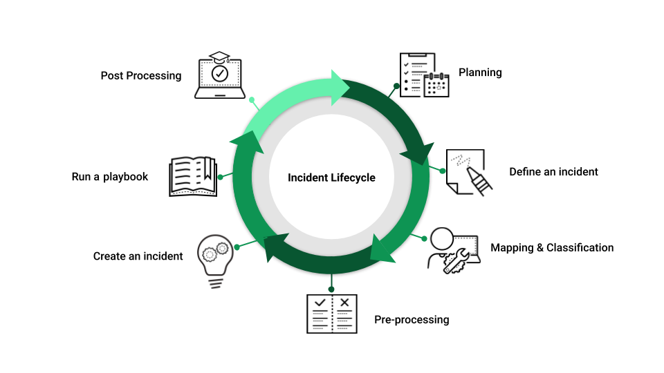

Cortex xSOAR is an orchestration and automation system used to bring all of the various pieces of your security apparatus together. Using Cortex xSOAR, you can define integrations with your 3rd-party security and incident management vendors. You can then trigger events from these integrations that become incidents in Cortex xSOAR. Once the incidents are created, you can run playbooks on these incidents to enrich them with information from other products in your system, which helps you complete the picture. In most cases, you can use rules and automation to determine if an incident requires further investigation or can be closed based on the findings. This enables your analysts to focus on the minority of incidents that require further investigation. 

The following diagram and sections further explain the incident lifecycle in Cortex XSOAR.

## Planning
Before you begin configuring integrations and ingesting information from 3rd parties, you should plan ahead. 

| Phase | Description | 
| ------ | ------ |
| Create fields | Used to display information from 3rd-party integrations and playbook tasks when an incident is created or processed. For more information, see [INSERT LINK TO Incident Fields doc]|
| Create incident types | Classify the different types of attacks with which your organization deals. For more information, see [INSERT LINK TO Incident Types doc] |
| Create incident layouts | Customize your layouts for each incident type to make sure the most relevant information is show for each type. For more information, see [INSERT LINK TO Customizing Layouts doc] |

This is an iterative process. After you initially create your fields and incident types, as well as implement them in your incident layouts, you will start the process of ingesting information. You will then see how accurately you have mapped out your information. Make changes as you go along and learn more about the information you are receiving. Information that is not mapped to fields will be available in labels, of course, but it is much easier to work with the information when it is properly mapped to a field and displayed in the relevant layouts.

## Configure Integrations
You configure integrations with your 3rd-party products to start fetching events. Events can be potential phishing emails, authentication attempts, SIEM events, and more. For information about configuring specific integrations, see [Cortex XSOAR Dev Hub](https://xsoar.pan.dev/).

## Classification and Mapping
Once you configure the integrations, you have to determine how the events ingested from those integrations will be classified as incidents. For example, for email integrations, you might want to classify items based on the subject field, but for SIEM events, you will classify by event type. In addition, you have to map the information coming from the integrations into the fields that you created in the planning stage. For more information, [INSERT LINK TO classification and mappping doc]

## Pre-processing
Pre-processing rules enable you to perform certain actions on incidents as they are ingested into Cortex XSOAR directly from the UI. Using the rules, you can select incoming events on which to perform actions, for example, link the incoming event to an existing incident, or based on configured conditions, drop the incoming incident altogether. For more information, see [INSERT LINK TO pre processing doc]

## Incident Created
Based on the definitions you provided in the Classification and Mapping stage, as well as the rules you created for pre-processing events, incidents of various types are created. The incidents all appear in the Incidents page of the Cortex xSOAR user interface, where you can start the process of investigating. For more information, see [INSERT LINK TO Incidents doc]

## Running Playbooks
Playbooks are triggered either when an incident is created or when you run them manually as part of an investigation. When triggered as part of an incident that was created, the playbooks for the type of incident that was classified will run on the incident. Alternatively, if you are manually running a playbook, you can select whichever playbook is relevant for the investigation. For example, playbooks can take IP address information from one integration and enrich that IP address with information from additional integrations or sources. 

## Post-processing
Once the incident is complete and you are ready to close it out, you can run various post-processing actions on the incident. For example, send an email to the person who opened the incident informing them that their incident has been resolved, or close an incident in a ticketing system.
