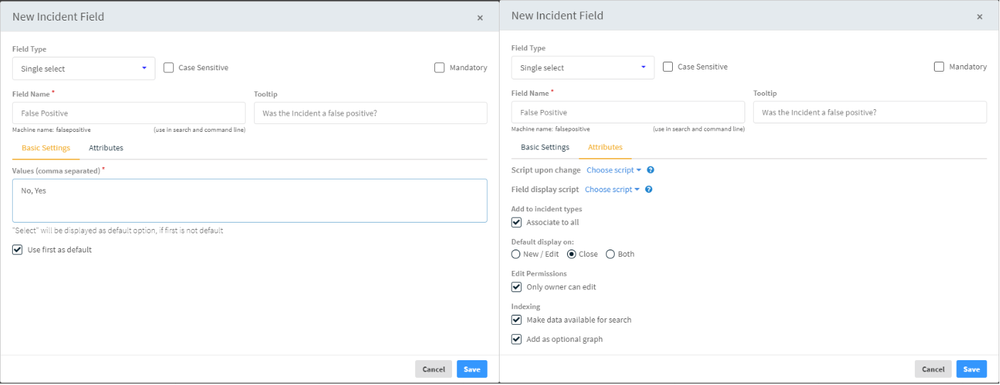
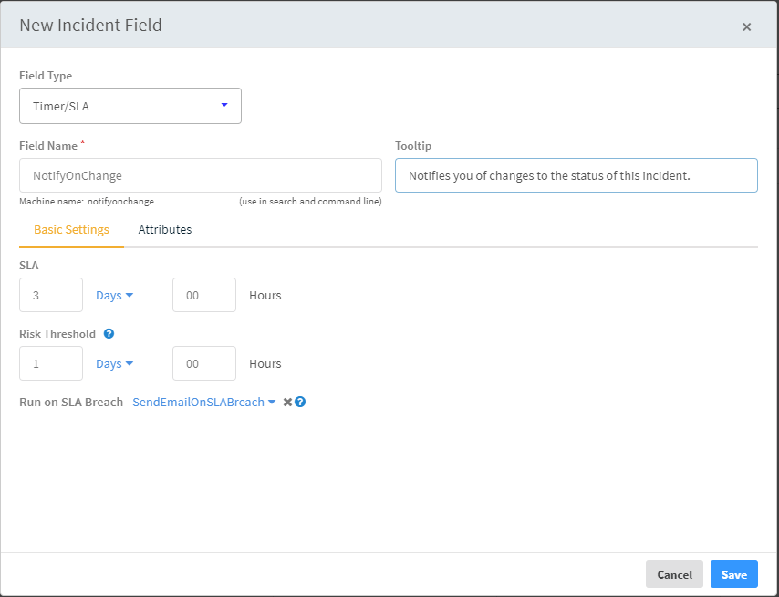

Incident Fields are used for accepting or populating incident data coming from incidents. You create fields for information you know will be coming from 3rd party integrations and in which you want to insert the information. The fields are added to Incident Type layouts and are mapped using the Classification and Mapping feature. In addition, Incident Fields can be populated by the incident team members during an investigation, at the beginning of the investigation or prior to closing the investigation.

**Note**: Creating Incident Fields should be an iterative process in which you continue to create fields as you gain a better understanding of your needs and the information available in the 3rd-party integrations that you use.

You can set and update all system incident fields using the setIncident command, of which each field is a command argument.

## Create a Custom Incident Field
You can define custom incident fields based on the information you want to display in your Incident Type layouts, as well as the information ingested from 3rd-party integrations. 

1. Navigate to **Settings** -> **Advanced** -> **Fields**.
2. Click the **+New Field** button and configure the field options. Depending on the field type, you can determine if the field contents are case-sensitive, as well as if the field is mandatory. 
   For a list of the supported field types, see Field Types, below.
   For a list of the fields and their descriptions, see Incident Field Properties, below.
3. Click Save.

You can now use the custom field in your incident type layouts.

## Field Types

There are different types of Incident Fields. You should define the Field Type according to the information that the field will contain. Valid field types are:

* Short Text (maximum of 60,000 characters)
* Long Text
* Number - can contain any number. The default number is 0 thus this field cannot be mandatory as it has a default value. Any quantity can be used.
* Boolean (checkbox)
* Single Select
* Multi Select
* Date picker
* Markdown
* HTML
* URL
* User - a user in the system to state a manager or fallback
* Role
* Attachments - enables adding an attachment, such as .doc, malicious files, reports, images of an incident.
* SLA - view how much time is left before an SLA becomes past due, as well as configure actions to take in the event that the SLA does pass. For more information, see Working with SLAs.
* Grid - include an interactive, editable grid as a field type for selected incident types or all incident types. For more information, see Grid Field.

## Incident Field Properties
The following tables list the fields that are common to all Incident Fields. For a list of fields, and their descriptions, that are specific to a Field Type, see the sections, below.

| Name | Description | 
| ------ | ------ |
| Field Type | Select the type of information this field contains. For a list of valid Field Types, see Field Types, above. |
| Field Name | A descriptive name indicating the information the field contains. |
| Tooltip | Additional information you want to make available to users of this field. |
| Script upon change | Select a script to run when the value of the field changes. |
| Field display script | Determines which fields display in forms, as well as the values that are available for single-select and multi-select fields. |
| Add to incident types | Determine for which incident types this field is available. By default, fields are available to all incident types. To change this, clear the **Associate to all** checkbox and select the specific incident types to which the field is available.  |
| Default display on | Determines at which point the field is available. For more information, see Examples, below. |
| Edit Permissions | Determine whether only the owner of the incident can edit this field. |
| Make data available for search | Determines if the values in these fields are available when searching. **Note**: In most cases, Cortex XSOAR recommends that you select this checkbox so values in the field are available for indexing and querying. However, in some cases, to avoid adverse affects on performance, you should clear this checkbox. For example, if you are ingesting an email to an email body field, we recommend that you not index the field.  |
| Add as optional graph | Determine if you can create a graph based on the contents of this field.  This field does not appear for all field types. |

## Basic Settings
The following table lists the fields that appear in the Basic Settings page, and their descriptions. The Basic Settings page is available for the following field types:

* Long text
* Multi select
* Short text
* Single select
* Tags

| Name | Description | 
| ------ | ------ |
| Placeholder | Define the text that will appear in the field before users enter a value. |
| Values | A comma separated list of values that are valid values for the field.  |

## Timer/SLA Fields
The following table lists the fields specific to Timer/SLA fields, and their descriptions.

| Name | Description | 
| ------ | ------ |
| SLA | Determine the amount of time in which this item needs to be resolved. If no value is entered, the field serves as a counter. |
| Risk Threshold | Determine the point in time at which an item is considered at risk of not meeting the SLA. By default, the threshold is 3 days, which is defined in the global system parameter. |
| Run on SLA Breach | In the Run on SLA Breach field, select the script to run when the SLA time has passed. For example, email the supervisor or change the assignee.
   **Note**: Only scripts to which you have added the SLA tag appear in list of scripts that you can select. |

## Examples
The following section shows several examples of common fields that are used in real-life incidents.

### False Positive
Below is an example of a mandatory Incident field "False Positive" to be filled at time of Incident Close. The Field can have a value YES or NO and the SOC admin should be able to query or run report based on this field. After this field is added, all incidents will need to have this filled in before an incident can be marked closed.

### SLA Fields
The following SLA field can be used to trigger a notification when the status effecting the SLA of an incident changes. In addition, if the SLA is breached, we have configured the field such that an email is sent to the owner's supervisor.

## Troubleshooting Conflicts with Custom Incident Fields
**Problem**

When trying to download a content update, you receive the following message:

Warning: content update has encountered some conflicts
This occurs when a content update has an incident field with the same name as a custom incident field that already exists in Demisto.

**Solution**

Click Install Content to force the update and retain your custom incident field. The content update will install without the system version of the incident field.