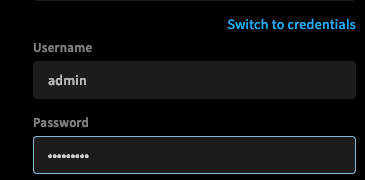

Integration Parameter Types are used to configure instances of the integration. When adding a parameter to an integration in Demisto, there are numerous types to choose from.
Each type will effect the parameter behavior and interaction with the user. 

## Boolean

This type of parameter creates a check box in the integration configuration. When the check box is ticked, the value in
the integration code would be `True`, and `False` otherwise.
Example:

Access: `demisto.params().get('proxy')` 

## Short Text

This type of parameter is used for short input parameters, such as server URLs, ports or queries. It creates a small
sized text box in the integration configuration.

Access: `demisto.params().get('url')`

## Long Text

This type of parameter is used for long text inputs, such as certificates. It creates a large sized text box in the 
integration configuration.

Access: `demisto.params().get('cert')`

## Encrypted

This type of parameters is used for encrypted inputs, such as API tokens. This should not be used for username-password 
credentials however. It creates a small sized text box with an encrypted text, which would also be stored encrypted in
the database. 

Access: `demisto.params().get('token')`

## Authentication

This type of parameter is used for username-password credentials - username as plain text and an encrypted password. 
It supports retrieving credentials from the Demisto credentials store(more info on the credentials store can be found in
the Demisto support portal).

Access: 

Username: `demisto.params().get('credentials', {}).get('identifier')`

Password: `demisto.params().get('credentials', {}).get('password')`

## Single Select

This type of parameter is used to allow selecting a single input from a list of allowed inputs. 

Access: `demisto.params().get('log')`

## Multi Select

This type of parameter is used to allow selecting multiple inputs from a list of allowed inputs.

Access: `demisto.params().get('sort')`

## Important Note

Once a parameter is set in an integration configuration, it is saved to the Demisto database, so before changing an existing
parameter you have to consider the existing values (backward compatibility).

