To keep playbook consistency, usability and readability, we've created some conventions and standards for our playbooks. We will also cover some common mistakes. Please make sure your playbooks meet these standards.

## Wording
### Playbooks
 - Names are **T**itle **C**ase.
 - Before specifying whether the playbook is generic or of a certain integration, add a dash (-).
 - Before adding "Test", add a (dash), but add it only at the very end of the name
 

-   When there is a second version (v2) playbook and you want to create a test for it, make sure the " - Test" is at the end, since you're testing a second version, and not creating a second version of a test for the older playbook

-   In the descriptions of playbooks specify the supported integrations or file types.
-   File formats are always in capital letters.
-   Integration names capitalized according to **T**itle **C**ase.

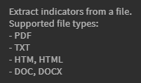
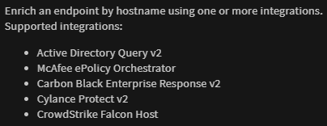

### Tasks
-   In task names - first letter is capitalized. The rest of the name is according to grammar rules, so capitalize the first letter of every part of an integration's name for example.
-   Verbs: use "Save" rather than "Saves" or "Saving", in the task names

-   Conditions end with a question mark. Also - "Is there a file" is better than "are there files" or "do we have a file" or "does a file exist".

-   Descriptions of tasks, unlike names of tasks use "extracts", "takes" and so on. For conditions: "Checks / Determines if / whether"). Always periods at the end.
-   We prefer to use “Determines” for “flags” - playbook inputs that affect the playbook flow / decision making. For simple conditions, usually use “Checks”.
Notice how the W in "Word" is capitalized because it's a name of a program

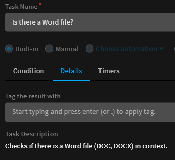

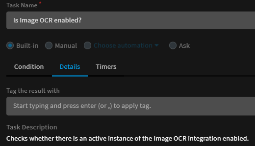

## Mistakes / Commonly Overlooked

-   Specify `auto-extract` settings for **every possible task** in the "Advanced" tab (tasks such as conditions or section headers don't support this). Rule of thumb: set to None, unless the data printed to war room contains crucial indicators.
(! `auto-extract` is a feature in Demisto that takes all outputs from a command and extract indicators from them)

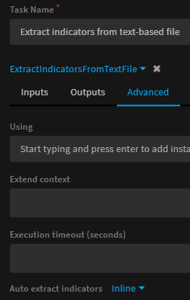
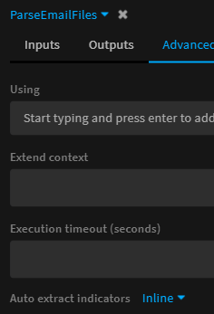
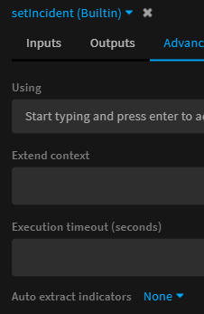

-   When outputting to context in integrations or scripts, use generic descriptions. For example, "Extract Indicators From File - Generic v2" has 2 different tasks outputting to "File.Text", but in the playbook outputs we have a description for only one.

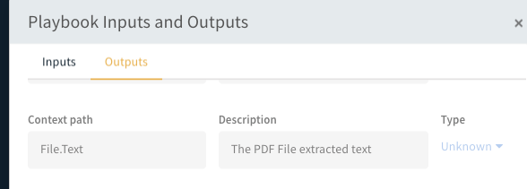

-   Set defaults for playbook inputs when needed

</img>

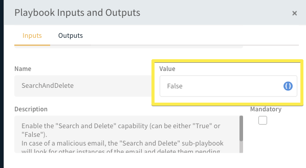

-   The playbooks are used by everyone, try to avoid “programming terms" when possible.

-   When working with indicators or data that should be unique, make sure to use “Uniq” (or “Unique” in 5.0) transformers to prevent as many duplications as possible. Do it in playbook inputs as well.

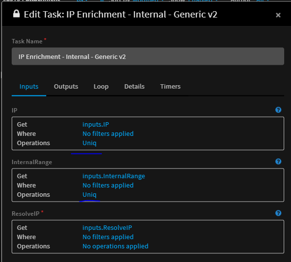
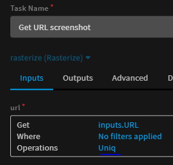

-   Avoid using [DT](https://github.com/demisto/content/tree/master/docs) wherever things can be done without it. Use our user friendly selectors and transformers, both because it looks better, and because you can add filters / operations to it.

* Also, it prevents a common mistake where data is passed by value instead of reference:

One place where this won’t work, is when using `Set`, which sets a value to an output, where you cannot really “get” that key, since it doesn’t exist.

-   Use “ignore case” when checking user inputs (such as True / False in playbook inputs)
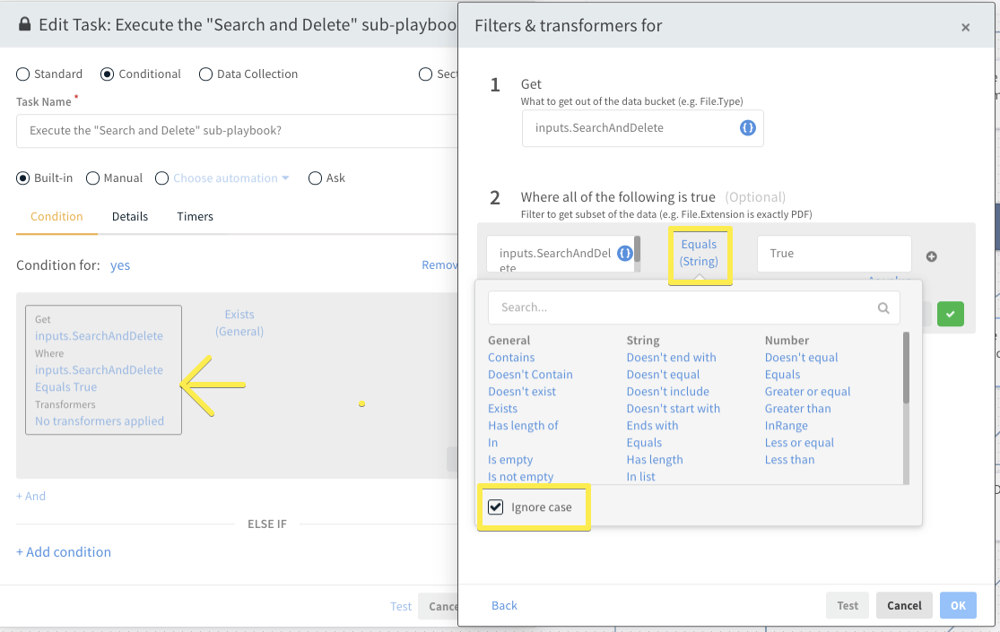

* Remember to confirm task changes in **ALL RELEVANT SUB-WINDOWS**. Do not cancel, do not switch task, or the changes won't be saved, and you won't always get a warning about it!

-   If you’re working on a playbook that has a sub-playbook, and you changed the inputs / outputs of that sub-playbook, the changes won’t be reflected in the parent playbook. You must refresh the page to see the changes. not just saving the playbook and re-opening it, using the browser refresh (F5) to refresh.

## Visualizing

-   Group similar tasks
-   Align tasks / headers of the same level
-   The priority in playbook looks is: **understanding of flow > readability of lines > aesthetics**
-   Avoid headers as timer starters / stoppers
-   Align the arrows and avoid "breaks". Sometimes moving a task and putting it back where it was can fix it. If necessary, utilize section headers to assist arrangement and to keep lines readable

Example - before:

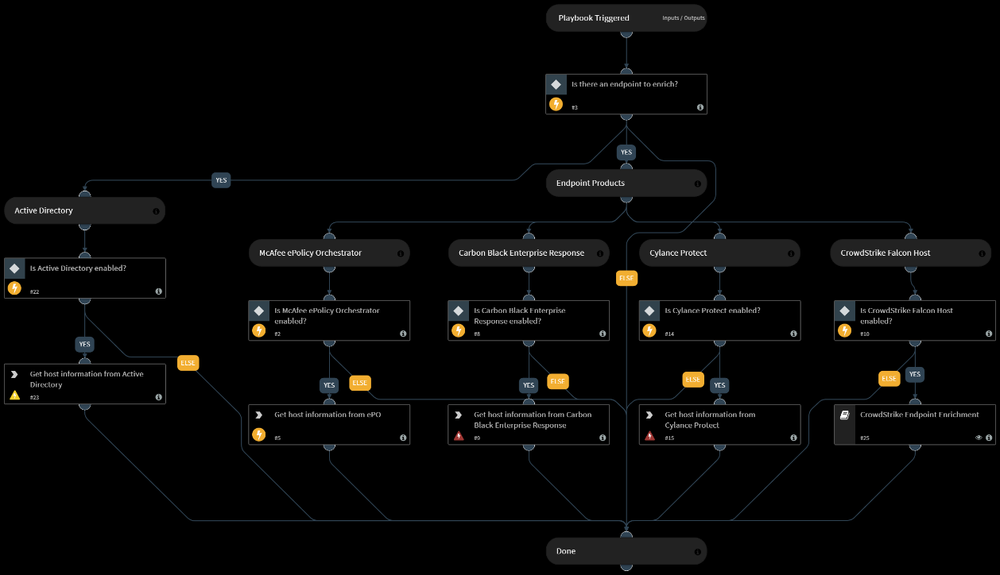

Example - after (moved all endpoint products to the right, and freed space for the "Else" line):

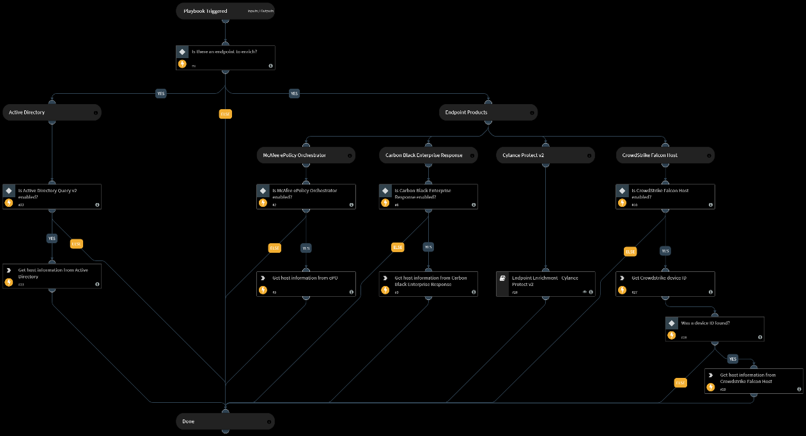

