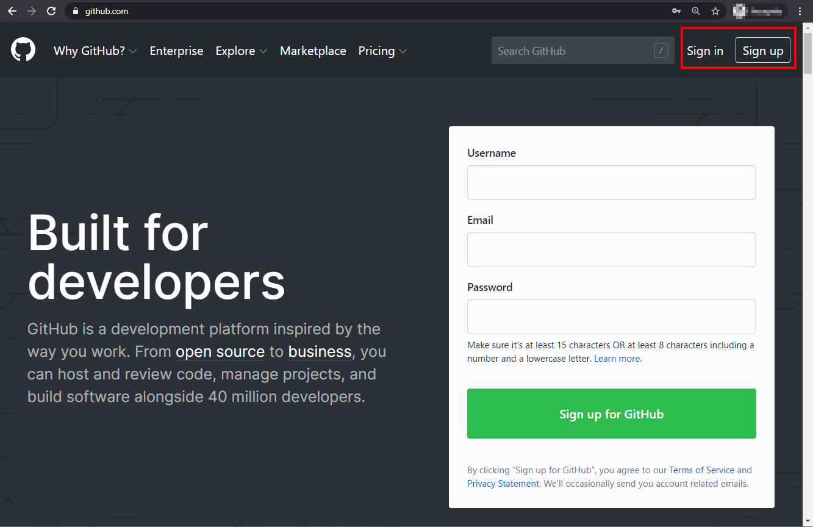
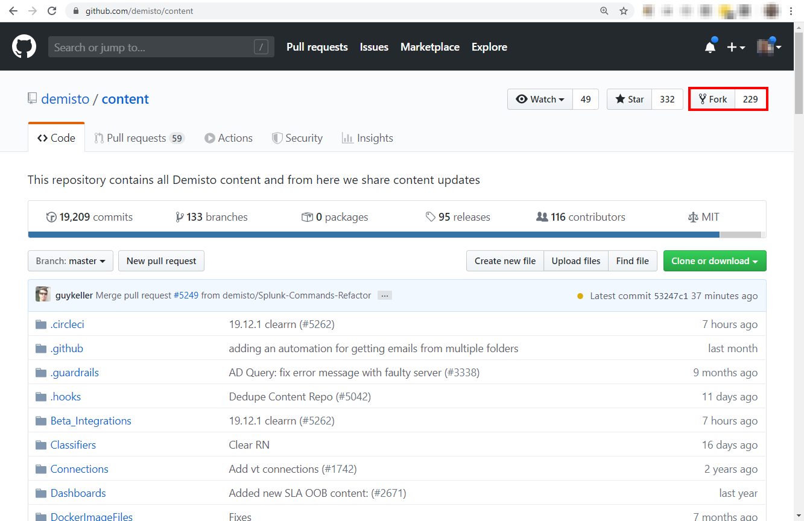
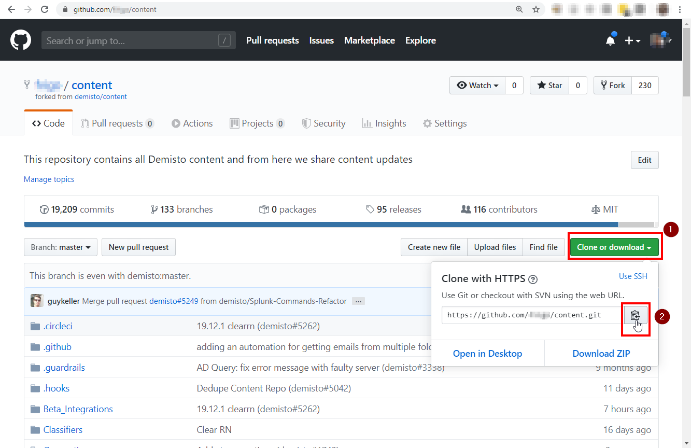

Thank you for showing interest in contributing to the Demisto content. We hope this experience will be easy and fun.

This tutorial will guide you on how to set up your dev environment to quickly start developing on Demisto. While in Demisto you can write code directly in the UI, which is awesome, you'll also need to set up your development environment outside of Demisto. This is because, in order to build a full fledged integration, you'll need to *lint* your code, run *pytest* for unit testing, create some documentation, submit your changes via *git* and more.

For a quick reference, just jump to the [Development Setup](dev-setup) page, otherwise keep reading for more details.

## Which tools should I use?

As mentioned, you'll need a combination of both the Demisto UI and other tools. 

As a general rule of the thumb, we recommend that you use an external IDE and toolchain when:
- Working on your [integration code](code-conventions) (YourIntegration.py)
- Working on the [unit test script](unit-testing) (YourIntegration_test.py)
- Working on the [CHANGELOG.md](changelog) and README.md documentation files
- Running the [linting](linting) and testing

Instead, you should use the Demisto UI when:
- Creating the [Test Playbooks](testing)
- Autogenerate the [integration documentation](integration-docs)
- Creating [example playbooks](playbooks)
- Working on the properties of your integration (parameters, commands, arguments, outputs, etc.)
- Testing the User Experience

## What IDE should I use?

When it comes to an External IDE, you should stick to what you're comfortable with.

We developed a free [plugin](https://plugins.jetbrains.com/plugin/12093-demisto-add-on-for-pycharm) for [PyCharm](https://www.jetbrains.com/pycharm/) that simplifies/automates a few tasks such as:
- Running unit tests
- Creating a blank integration or automation script
- Uploading/Downloading your integration code to/from Demisto
- Running commands directly on Demisto

However, if you want to a different IDE (Visual Studio Code, Sublime, vi, emacs, etc.) it's totally fine! It just means that some of those tasks must be performed manually. To automate it, we are working on a new [demisto-sdk](https://github.com/demisto/demisto-sdk) project, which is currently in beta stage and will be documented soon.

## Requirements

Here are few requirements to make sure that you an easily build an Demisto Integration without running into issues down the road.

### Demisto

You need an instance of Demisto up and running. You can Sign Up for the [Demisto Free Edition](https://start.paloaltonetworks.com/sign-up-for-demisto-free-edition) or, if you're entitled to, contact your Business Development representative to have a non-production license.

### Operating System

So far we've been using the following Operating Systems:
- MacOS
- Linux
- Windows (only with WSL - [Windows Subsystem For Linux](https://docs.microsoft.com/en-us/windows/wsl/about))

If you successfully manage to get this work on other platforms (native Windows, OpenBSD, etc.) , please let us know and we'll add it to the tutorial! (click on Report an issue at the bottom of this page).

### Python

You will need to build your integration using **Python** and, more specifically, Python 3.6+. While some content is built via Javascript and Python 2, we require Python 3.6+ for contributions.

**Note**: You don't need to be a a Python expert (I'm not!) to write a good integration, although some intermediate level knowledge is preferred.

It is also recommended to have both Python 2 and Python 3 installed on your system: for that purpose, please download and install **[pyenv](https://github.com/pyenv/pyenv)**. It allows to easily manage multiple versions of Python on your system and have them coexist. If you don't use `pyenv` you might have problems when creating a `virtualenv` that contains both Python 2 and Python 3 under MacOS.

### GitHub

You will need a **[GitHub](https://github.com)** account, as the contribution process requires you to submit a Pull Request in the [Demisto Content Repository](https://github.com/demisto/content). To learn more about Pull Requests and contributing , check out the [Collaborating with issue and pull requests](https://help.github.com/en/github/collaborating-with-issues-and-pull-requests) tutorial on GitHub, as well as our [Content Contribution Guide](https://github.com/demisto/content/blob/master/CONTRIBUTING.md).

And you will need a `git` client on your system (git, GitHub Desktop, SourceTree, etc). In the examples we'll just use the `git` command line client.

### Docker

In order to be able to run linting and tests, you should have **Docker** installed on your machine. This way you can test your code using the same Python environment as the one that will run inside the Demisto instance.

*Note* if you're using WSL 1, you cannot run Docker natively on WSL, but you can install Docker Desktop on Windows and configure WSL to communicate to it using [this](https://nickjanetakis.com/blog/setting-up-docker-for-windows-and-wsl-to-work-flawlessly) tutorial.


## The Tutorial Starts Here

Finally! The tutorial will guide you through the following steps:

1. Verify the requirements
2. Fork the GitHub repo
3. Clone the GitHub fork locally
4. Run the bootstrap script
5. Copy the HelloWorld integration
6. Run the linter and unit tests

Let's go!

### Step 1: Verify the requirements

Let's go make sure that all the requirements are satisfied, one by one.

#### Demisto

We are assuming that Demisto is already installed. For more information about installing Demisto pleae refer to [this article](https://support.demisto.com/hc/en-us/sections/360001323614-Installing-Demisto) (Support Center credentials are required)

Check if your Demisto License is correctly installed by navigating to *Settings* -> *ABOUT* -> *License* and make sure that everything is green:


**PRO tip**: you can quickly navigate to different pages within Demisto by hitting *Ctrl-K* and then typing what you want. For the license page, for example, type */settings/license* or just *lic* and select the autocomplete:


#### Operating System

We assume you have an Operating System and that is working :)

*Note:* if you're using **Windows with WSL**, and your code resides to a shared folder on the Windows tree (i.e. `/mnt/c/code/demisto`), please make sure that the folder is set to be [case sensitive](https://devblogs.microsoft.com/commandline/improved-per-directory-case-sensitivity-support-in-wsl/).

#### Python and pyenv

You will need both `python2` and `python3` installed on your system. While there are multiple ways to achieve this, we recommend using `pyenv`. At the time of writing, the latest versions of Python are *2.7.17* and *3.7.5*, so we're going to use these.

Make sure `pyenv` in installed:

```bash
sb@dddd:~/demisto$ pyenv -v
pyenv 1.2.15
sb@dddd:~/demisto$~/demisto$
```

If not, please follow the instructions [here](https://github.com/pyenv/pyenv#installation). Either Homebrew for MacOS or the automatic installer on Linux/WSL work fine.

Make sure that the required versions of Python are available:

```bash
sb@dddd:~/demisto$ pyenv versions
  2.7.17
  3.7.5
sb@dddd:~/demisto$
```

If they're missing, you will need to install them. As `pyenv` compiles CPython, you might need some libraries. Depending on your OS, [this](https://github.com/pyenv/pyenv/wiki/Common-build-problems) article explains how to install the required dependencies and provides useful troubleshooting info.

Also, it's a good time to take a break as installing might take a bit.

Install Python 2.7.17 and 3.7.5:

```bash
sb@dddd:~/demisto$ pyenv install 2.7.17
Downloading Python-2.7.17.tar.xz...
-> https://www.python.org/ftp/python/2.7.17/Python-2.7.17.tar.xz
Installing Python-2.7.17...
Installed Python-2.7.17 to /home/sb/.pyenv/versions/2.7.17

sb@dddd:~/demisto$ pyenv install 3.7.5
Downloading Python-3.7.5.tar.xz...
-> https://www.python.org/ftp/python/3.7.5/Python-3.7.5.tar.xz
Installing Python-3.7.5...
Installed Python-3.7.5 to /home/sb/.pyenv/versions/3.7.5

sb@dddd:~/demisto$ pyenv versions
  2.7.17
  3.7.5
sb@dddd:~/demisto$
```

Awesome, let's move forward!

#### GitHub

Not much to check here, just go to [GitHub](https://github.com) and make sure that you have an account or Sign-Up:



#### Docker

Make sure that `docker` is installed on your system and is working correctly by running the `hello-world` container:

```bash
sb@dddd:~/demisto$ docker run hello-world

Hello from Docker!
This message shows that your installation appears to be working correctly.

To generate this message, Docker took the following steps:
 1. The Docker client contacted the Docker daemon.
 2. The Docker daemon pulled the "hello-world" image from the Docker Hub.
    (amd64)
 3. The Docker daemon created a new container from that image which runs the
    executable that produces the output you are currently reading.
 4. The Docker daemon streamed that output to the Docker client, which sent it
    to your terminal.

To try something more ambitious, you can run an Ubuntu container with:
 $ docker run -it ubuntu bash

Share images, automate workflows, and more with a free Docker ID:
 https://hub.docker.com/

For more examples and ideas, visit:
 https://docs.docker.com/get-started/

sb@dddd:~/demisto$
```

*Note:* if you're using Windows with WSL 1, you can still use Docker by following [this](https://nickjanetakis.com/blog/setting-up-docker-for-windows-and-wsl-to-work-flawlessly) tutorial.

Great, everything is ready now.

### Step 2: Fork the GitHub repo

Make sure you're logged on GitHub and navigate to the [Demisto Content Repo](https://github.com/demisto/content) and click on **Fork**:



Once the fork is complete, copy the your URL:



This is the fork where you will commit your code and, once ready, create the Pull Request to submit your contribution back to the Demisto Content repository.

### Step 3: Clone the GitHub fork locally

Back to the shell, create a folder (in the tutorial we'll use `~/demisto`) and clone your fork of the content repository using `git clone [your_fork_url]`, where `your_fork_url` is the URL you copied in the previous step:

```bash
sb@dddd:~$ mkdir demisto
sb@dddd:~$ cd demisto
sb@dddd:~/demisto$ git clone https://github.com/[your_fork_url]/content.git
Cloning into 'content'...
remote: Enumerating objects: 108, done.
remote: Counting objects: 100% (108/108), done.
remote: Compressing objects: 100% (90/90), done.
remote: Total 101143 (delta 50), reused 53 (delta 18), pack-reused 101035
Receiving objects: 100% (101143/101143), 110.65 MiB | 11.04 MiB/s, done.
Resolving deltas: 100% (73634/73634), done.
Checking out files: 100% (4522/4522), done.
sb@dddd:~/demisto$
```

*Note:* you must clone **your fork** of the repository, as you will need to be able to write into it. Do not clone `demisto/content`.

### Step 4: Run the bootstrap script

Before running the `bootstrap` script that creates the virtual environment, let's set up `pyenv` to work correctly in the `content` folder you just cloned.

At the beginning, no local python interpreter has been set via `pyenv`:
```bash
sb@dddd:~/demisto$ cd content
sb@dddd:~/demisto/content$ pyenv local
pyenv: no local version configured for this directory
```

You can tell `pyenv` to use the latest versions of Python 2 and Python 3 you previously installed and verify that everything is set correctly:
```
sb@dddd:~/demisto/content$ pyenv local
3.7.5
2.7.17

sb@dddd:~/demisto/content$ which python2
/home/sb/.pyenv/shims/python2

sb@dddd:~/demisto/content$ which python3
/home/sb/.pyenv/shims/python3

sb@dddd:~/demisto/content$ python2 -V
Python 2.7.17
sb@dddd:~/demisto/content$ python3 -V
Ptyhon 3.7.5
```

Now that Python is set up correctly, also install `pipenv` that will be useful when running Unit Tests

```bash
sb@dddd:~/demisto/content$ pip install pipenv
Collecting pipenv

[... output omitted for brevity ...]

Successfully installed certifi-2019.11.28 pipenv-2018.11.26 virtualenv-16.7.9 virtualenv-clone-0.5.3

sb@dddd:~/demisto/content$ which pipenv
/home/fvigo/.pyenv/shims/pipenv
```

OK, now you can run the `.hooks/bootstrap` script that will install the dependencies and create the `virtualenv`:
```bash
sb@dddd:~/demisto/content$ .hooks/bootstrap
Installing 'pre-commit' hooks
=======================
Initializing virtual env...
Running virtualenv with interpreter /home/sb/.pyenv/shims/python3
Already using interpreter /home/sb/.pyenv/versions/3.7.5/bin/python3
Using base prefix '/home/sb/.pyenv/versions/3.7.5'
New python executable in /home/sb/demisto/content/venv/bin/python3
Also creating executable in /home/sb/demisto/content/venv/bin/python
Installing setuptools, pip, wheel...
done.
Running virtualenv with interpreter /home/sb/.pyenv/shims/python2
Already using interpreter /home/sb/.pyenv/versions/2.7.17/bin/python2
New python executable in /home/sb/demisto/content/venv/bin/python2

[... output omitted for brevity ...]

Successfully installed GitPython-3.0.5 PyYAML-5.2 atomicwrites-1.3.0 attrs-19.3.0 autopep8-1.4.4 bandit-1.6.2 beautifulsoup4-4.8.1 bs4-0.0.1 certifi-2019.11.28 chardet-3.0.4 demisto-py-2.0.6 demisto-sdk-0.2.6 docopt-0.6.2 entrypoints-0.3 flake8-3.7.8 freezegun-0.3.12 gitdb2-2.0.6 idna-2.8 importlib-metadata-1.3.0 mccabe-0.6.1 more-itertools-8.0.2 mypy-0.730 mypy-extensions-0.4.3 packaging-19.2 pbr-5.4.4 pipenv-2018.11.26 pluggy-0.13.1 py-1.8.0 pycodestyle-2.5.0 pyflakes-2.1.1 pykwalify-1.7.0 pyparsing-2.4.6 pypdf2-1.26.0 pytest-5.2.1 pytest-mock-1.11.1 python-dateutil-2.8.1 pytz-2019.3 requests-2.22.0 requests-mock-1.7.0 ruamel.yaml-0.16.5 ruamel.yaml.clib-0.2.0 six-1.13.0 smmap2-2.0.5 soupsieve-1.9.5 stevedore-1.31.0 typed-ast-1.4.0 typing-extensions-3.7.4.1 tzlocal-2.0.0 urllib3-1.25.7 virtualenv-16.7.9 virtualenv-clone-0.5.3 wcwidth-0.1.7 zipp-0.6.0    ==========================
Done setting up virtualenv at directory 'venv'
Activate the venv by running: . ./venv/bin/activate
Deactivate by running: deactivate
sb@dddd:~/demisto/content$
```

Everything is configured, and you can start developing. When you work on your integration, you can activate the `virtualenv` with the `activate` command:
```bash
sb@dddd:~/demisto/content$ . ./venv/bin/activate
(venv) sb@dddd:~/demisto/content$
```

Note the `(venv)` in front of the prompt. You can always leave the `virtualenv` using the `deactivate` command:

```bash
(venv) sb@dddd:~/demisto/content$ deactivate
sb@dddd:~/demisto/content$
```

### Step 5: Copy the HelloWorld integration

Our content ships with an `HelloWorld` integration that provides basic functionality and is useful to understand how to create integrations.

It's located in the `Integrations/HelloWorld` folder. We'll make a copy of it and run the unit testing in order to make sure that everything is fine.

```bash
(venv) sb@dddd:~/demisto/content$ cp -a Integrations/HelloWorld Integrations/MyIntegration
(venv) sb@dddd:~/demisto/content$
```


### Step 6: Run the linter and unit tests