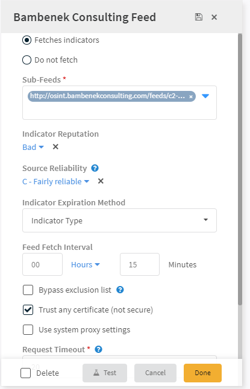
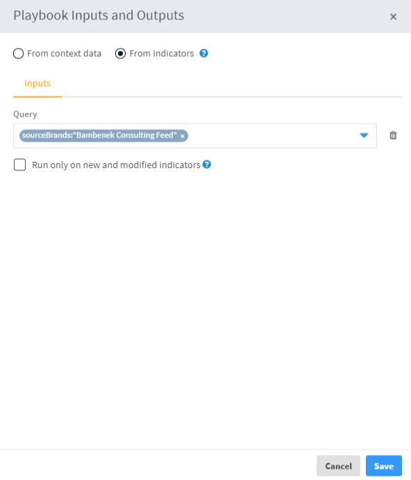
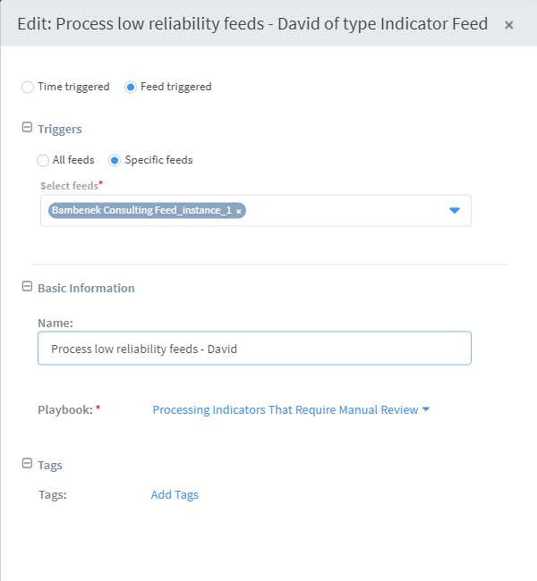
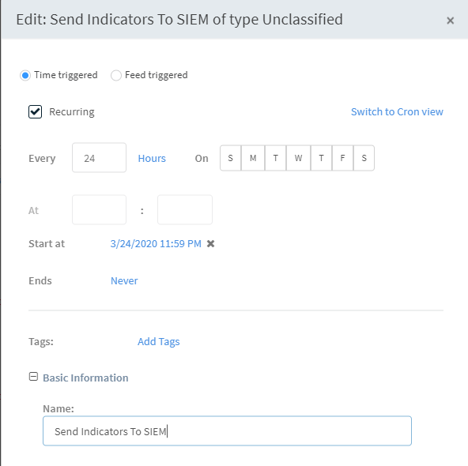
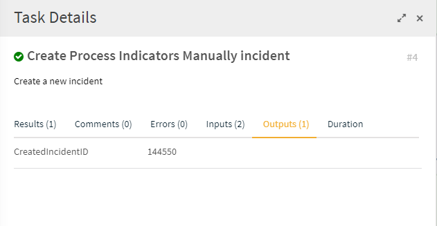
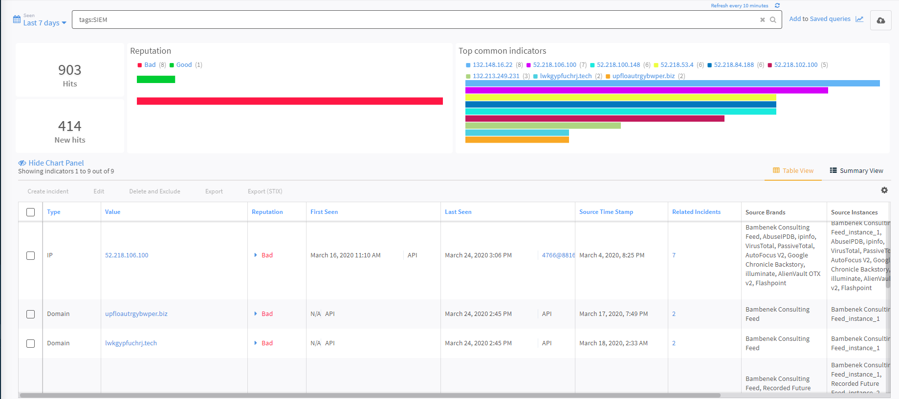

This document takes you through a flow of setting up a playbook to take indicators from a Threat Intellgience feed and push it to your SIEM. It walks you through parts of the following:

* Defining a Threat Intelligence Management (TIM) feed to ingest indicators to your system
* Customizing a playbook that is triggered by the TIM feed to process the indicators and determine which are legitimate.
* Defining a job that runs every time indicators are ingested to the feed.
* Reviewing the indicators and determing which tags each indicator should be tagged with.
* Customizing a job that is time-based to push the indicators to the SIEM

This document does not cover every possible scenario in this flow, as that would be impossible. We attempt to give you a real-life scenario touching on certain points from which you can extrapolate to other scenarios.

## Configure the Threat Intelligence Feed

Cortex XSOAR comes with the several TIM feeds out of the box. In this flow, we will define the Bambenek Consulting feed, as it is considered relatively reliable.

1. Navigate to **Settings** -> **Integrations** -> **Servers and Services** and search for Bambenek.

2. Click **Add instance**.

  a. Under **Sub-Feeds**, select from where you want to pull the data.
  b. Determine the default reputation that you want indicators from this feed to receive. 
  c. You can change the **Source Reliability**. Cortex XSOAR has this feed defined as fairly reliable.
  d. Determine when the indicator expires and how often to fetch indicators from the feed.

3. Click **Done**.

## Customize your Playbook

After configuring the feed, we need to customize the playbook. 

1. Navigate to **Playbooks** and search for the Processing Indicators That Require Manual Review playbook. This is the playbook we will trigger in our scheduled task.

2. Click **Playbook Triggered** task at the very top. 

  a. Under the Inputs of the From context data radio button, we put a value of *Yes* so an incident with our indicators for review will open automatically. 
  b. Select the **From indicators** radio button.
  c. Under **Query**, enter a query to process the specific indicators that you want.
  d. Click **Save**.
  e. Click the From co

3. Click **Save Version**.

## Define a Job

Now that the feed and playbook are set up, you need to define a job that will trigger the playbook when the indicators are fetched.

1. Navigate to **Jobs** and click **New Job**.

  a. Select the **Feed triggered** radio button.
  b. Under **Triggers**, select **Specific feeds** and select the feed whose completion will trigger this job. In this case, it should be the Bambenek Consulting feed you defined earlier.
  c. Enter a descriptive name for the job.
  d. Select the Processing Indicators That Require Manual Review playbook to run when this job is triggered. 

2. Click **Create New Job**.

## Customize the Add All Indicator Types To SIEM Playbook

Now that we have the infrastructure for pushing the feeds set up, we need to customize the Add All Indicator Types To SIEM playbook. This playbook, as it is aptly named, pushes the indicators that have been tagged to their respective lists in the SIEM. By default, the playbook is configured to work with ArcSight and QRadar, however, you should change this to match the SIEM in your system. 

## Define a Job to Push the Indicators to the SIEM

After setting up all of the infrastructure, we need to create one final job to push all of the content that we tag to our SIEM. 

1. Navigate to **Jobs** and click **New Job**.

  a. Select the **Time triggered** radio button.
  b. Select the **Recurring** checkbox and determine how often you want the job to run.
       In our example, we have it run daily at midnight.
  c. Enter a descriptive name for the job.
  d. Under **Playbook**, select the Add All Indicator Types To SIEM playbook to run when this job runs. 

2. Click **Create New Job**.

## Test the Flow

Now that everything is set up, let's test the flow.

1. Navigate to **Settings** -> **Integrations** -> **Servers and Services** and edit the setting for the Bambenek instance we created earlier.
  a. Click **Re-fetch indicators from this instance**.
  b. Click **Fetch**.
2. Navigate to **Jobs**.   The feed-triggered job we created earlier should be running.
  a. Click **Running**.   This takes you into the actual job. 
  b. Navigate to the **Work Plan** page and click on the task labeled *Create Process Indicators Manually incident*. 
  c. Under the **Outputs** tab, note the incident ID for the incident that was created.

3. Navigate to **Incidents** and click on the incident that was created in the previous step.
  a. Under the **Indicators** page, click on an indicator. 
  b. Click the edit icon and add the tags that apply to the indicator. We have added the approved_black tag. This is the tag that the Add All Indicator Types To SIEM playbook used to determine what needs to be pushed. If you use a different tag, make sure to change the playbook accordingly.   **Note** You can add tags in bulk to multiple indicators from the main Indicators page, however you will not be able to remove any tags that are already applied to an indicator.

  c. Under the **Work Plan** page, click the *Manually review the incident* task, select the **Yes** radio button, and click **Mark Completed**.

4. Navigate to **Jobs**. 
  a. Select the time-triggered job you defined to push content to the SIEM and click **Run now**. 
  b. Click **Running**.
  c. Under the **Work Plan** page, verify that the playbook completed. 

5. Navigate to **Indicators**. 
  a. In the query, enter *tags:SIEM*. This is the tag appended to every indicator that has been processed and pushed to the SIEM.

    
